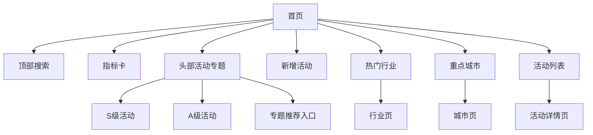
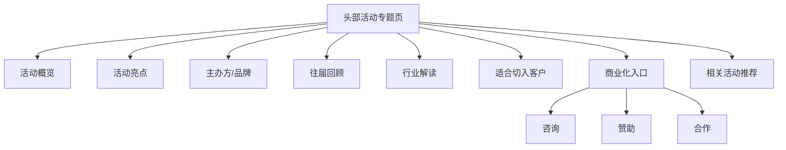

# 线下展会与活动网站 PRD

版本：v0.1  
日期：2026-06-26  
参考基础：[行业分析与投入建议报告.html](/Users/wang/Desktop/CodeX/lhbmarket/行业分析与投入建议报告.html)

## 1. 背景

现有页面已经明确了目标行业、目标品牌、产品线匹配和 BD 优先级，但它更像一份静态分析报告。下一步要做的，不是简单把“活动”列出来，而是做成一个面向业务的线下展会与活动情报站。

这个站的核心价值有两个：
1. 帮业务快速找到“哪些线下活动值得跟进、哪些品牌正在动、哪些城市正在热”。
2. 把头部活动做成高质量专题内容，并为商业化预留足够曝光和线索入口。

## 2. 产品目标

1. 汇总与目标行业相关的线下展会、峰会、发布会、快闪、体验活动、招商会等。
2. 支持按行业、城市、活动类型、时间、新增/历史、品牌/主办方筛选。
3. 给头部活动足够曝光，并沉淀专题页、品牌页、城市页。
4. 把内容能力和商业转化结合起来，形成可持续变现路径。

## 3. 产品定位

不是“展会大全”，而是“行业视角的活动情报系统”。

核心判断标准：
1. 这场活动是否对应明确行业。
2. 是否有潜在客户或合作方。
3. 是否值得重点曝光。
4. 是否能转成线索、合作、赞助或数据服务。

## 4. 目标用户

1. BD / 销售：找客户、找切入口、找合作场景。
2. 内容 / 研究：找可写、可沉淀、可复用的活动信息。
3. 业务负责人：看行业热度、城市热度、品牌活跃度。
4. 外部访客：找活动、查信息、判断是否值得参加或合作。

## 5. 信息架构

1. 首页总览
2. 活动列表页
3. 活动详情页
4. 行业页
5. 城市页
6. 品牌 / 主办方页
7. 新增活动页
8. 历史活动归档页
9. 专题页（头部活动专用）

## 6. 核心功能

### 6.1 活动检索

支持组合筛选：
1. 行业
2. 城市
3. 活动类型
4. 时间范围
5. 新增 / 历史
6. 品牌 / 主办方
7. 场馆
8. 关键词

### 6.2 活动卡片

每个活动至少展示：
1. 活动名称
2. 时间
3. 城市 / 场馆
4. 行业标签
5. 类型标签
6. 主办方 / 参展品牌
7. 适合切入的客户类型
8. 是否头部活动

### 6.3 活动详情页

活动详情页要比列表页更完整，至少包括：
1. 活动概览
2. 主办方信息
3. 关联行业
4. 参展品牌 / 目标客户
5. 往届信息
6. 适合切入的产品或服务
7. 是否建议重点跟进
8. 来源与可信度

### 6.4 行业页

每个行业页聚合：
1. 该行业相关活动
2. 活动热度趋势
3. 活跃品牌 / 主办方
4. 适合合作的产品方向
5. 重点推荐的头部活动

### 6.5 城市页

每个城市页聚合：
1. 活动数量
2. 头部活动
3. 活跃行业
4. 活跃品牌
5. 城市标签，例如一线、新一线、核心二线

### 6.6 新增与历史

1. 新增活动：近 7 天 / 30 天新增。
2. 历史活动：按年份、季度归档。
3. 已结束活动保留，但要清晰区分状态。

## 7. 活动分级

建议把活动分成 4 级：

1. S 级：头部活动，必须专题化、优先曝光。
2. A 级：重点活动，进入首页推荐和行业页优先位。
3. B 级：常规活动，进入列表和筛选。
4. C 级：归档活动，仅供检索和回看。

### 分级依据

1. 行业价值
2. 品牌集中度
3. 城市影响力
4. 商业转化潜力
5. 内容完整度
6. 是否有明确线索入口

## 8. 商业化路径

这是产品必须从一开始就预留的能力。

### 8.1 曝光收入

1. 首页推荐位
2. 行业页置顶位
3. 城市页置顶位
4. 活动详情页赞助位

### 8.2 专题收入

1. 头部活动专题页
2. 品牌联合专题
3. 行业年度榜单专题
4. 城市活动地图专题

### 8.3 线索收入

1. 预约合作
2. 参展咨询
3. 赞助咨询
4. 获取参展名录
5. 获取活动报告

### 8.4 数据服务

1. 行业活动榜单
2. 城市热度榜
3. 品牌活动日历
4. 历史活动数据包
5. 导出服务

## 9. 内容标准

### 9.1 头部活动标准

头部活动必须具备：
1. 基础信息完整
2. 行业判断明确
3. 品牌/主办方清晰
4. 内容质量高于普通条目
5. 有可执行的合作或切入建议
6. 有足够曝光位

### 9.2 普通活动标准

普通活动重点保证：
1. 准确
2. 可检索
3. 标签统一
4. 更新时间明确

## 10. 数据字段

建议最少字段如下：

1. 活动 ID
2. 活动名称
3. 活动类型
4. 行业标签
5. 品牌标签
6. 主办方
7. 城市
8. 场馆
9. 开始时间
10. 结束时间
11. 状态
12. 是否新增
13. 是否头部
14. 关联客户
15. 推荐切入产品
16. 内容摘要
17. 来源
18. 可信度
19. 更新时间

## 11. 首页结构建议

首页建议直接进入内容，不做介绍页。

推荐结构：
1. 顶部四个指标卡
   - 活动总数
   - 新增活动数
   - 覆盖城市数
   - 头部活动数
2. 中部头部活动专题位
3. 下方活动列表
4. 右侧筛选栏
5. 底部行业与城市入口

## 12. 页面优先级

### 第一阶段
1. 首页
2. 活动列表页
3. 活动详情页
4. 筛选能力

### 第二阶段
1. 行业页
2. 城市页
3. 新增活动页
4. 历史归档页

### 第三阶段
1. 头部专题页
2. 商业化位
3. 数据服务导出
4. 活动推荐机制

## 13. MVP 范围

先做最小可用版本：
1. 覆盖核心行业和重点城市。
2. 先整理头部活动和高价值活动。
3. 支持列表、筛选、详情。
4. 头部活动先人工精选，不急着全自动化。

## 14. 成功标准

1. 用户能在 3 秒内找到目标行业活动。
2. 用户能在 1 分钟内判断是否值得跟进。
3. 头部活动有明显曝光和更高内容质量。
4. 站点能够承接商业化合作和线索转化。

## 15. 风险与约束

1. 活动来源杂，数据质量不一致。
2. 如果不分级，头部活动会被普通活动淹没。
3. 如果没有商业化位，后续很难变现。
4. 如果内容标准不统一，专题页质量会很散。

## 16. 待确认问题

1. 目标行业是否完全沿用现有报告中的行业体系。
2. 头部活动的判定规则是否需要更明确的打分标准。
3. 是否要优先覆盖某几个城市。
4. 商业化方式优先做曝光、线索还是数据服务。
5. 是否需要支持活动抓取和自动更新。

## 17. 已确认事项

1. 目标行业暂时沿用现有报告中的行业体系。
2. 头部活动不先做固定打分模型，优先基于抓取到的多维信息综合判断。
3. 优先覆盖城市：上海、杭州、广州、深圳、北京。
4. 商业化方式暂不提前定死，后续继续琢磨，曝光、线索、数据服务都保留。
5. 活动抓取和自动更新要支持，但不放在 1.0 先做，等网站 1.0 打磨后再开启。

## 18. 下一步节奏

1. 先把 1.0 的信息架构和页面结构定死。
2. 再细化头部活动的信息维度和专题页标准。
3. 先手工整理重点城市与重点行业的活动样本。
4. 等 1.0 稳定后，再接自动抓取和更新机制。

## 19. 1.0 页面模板

### 19.1 首页

首页不做介绍，直接做检索和推荐。

模块：
1. 顶部搜索框
2. 四个指标卡
3. 头部活动专题推荐区
4. 最新新增活动
5. 热门行业入口
6. 热门城市入口
7. 活动列表

### 19.2 活动列表页

模块：
1. 左侧筛选栏
2. 顶部结果摘要
3. 活动卡片流
4. 分页或无限滚动

### 19.3 活动详情页

模块：
1. 活动头图 / 头部信息
2. 基础信息卡
3. 行业与城市标签
4. 主办方 / 品牌 / 参展方信息
5. 往届信息
6. 内容摘要与价值判断
7. 适合切入的业务方向
8. 商业化入口
9. 相关活动推荐

### 19.4 行业页

模块：
1. 行业概览
2. 该行业相关头部活动
3. 该行业活跃城市
4. 该行业活跃品牌
5. 该行业活动列表

### 19.5 城市页

模块：
1. 城市概览
2. 城市内头部活动
3. 城市内活跃行业
4. 城市内活动列表
5. 城市热度说明

### 19.6 专题页

头部活动单独做专题页，模块：
1. 活动核心信息
2. 活动亮点
3. 展商 / 品牌列表
4. 往届回顾
5. 行业解读
6. 适合合作的客户类型
7. 咨询 / 赞助 / 合作入口

## 20. 数据字段字典

### 20.1 基础字段

1. `id`：活动唯一 ID
2. `title`：活动名称
3. `type`：活动类型
4. `industry_tags`：行业标签
5. `brand_tags`：品牌标签
6. `host`：主办方
7. `city`：城市
8. `venue`：场馆
9. `start_date`：开始时间
10. `end_date`：结束时间
11. `status`：状态
12. `is_new`：是否新增
13. `is_headline`：是否头部
14. `source`：来源
15. `updated_at`：更新时间

### 20.2 内容字段

1. `summary`：活动摘要
2. `highlights`：亮点
3. `fit_clients`：适合切入的客户类型
4. `fit_products`：推荐切入产品
5. `value_judgement`：价值判断
6. `confidence`：可信度
7. `history_notes`：往届备注

### 20.3 商业化字段

1. `monetize_type`：商业化方式
2. `sponsor_slot`：赞助位标记
3. `lead_form_url`：线索表单链接
4. `report_download`：报告下载入口
5. `contact_entry`：合作联系入口

## 21. 头部活动判断原则

不先定死机械分数，先看信息密度与业务价值。综合判断时重点看：
1. 行业是否在目标范围内。
2. 是否有头部品牌、头部主办方或明显聚集效应。
3. 是否存在强曝光需求和合作入口。
4. 是否有往届沉淀、可做深内容。
5. 是否能带来线索、合作或商业化价值。
6. 是否值得单独做专题。

## 22. 内容运营机制

### 22.1 新增活动

1. 先人工录入或半人工整理。
2. 标注新增时间和来源。
3. 进入新增活动池后再做头部判定。

### 22.2 历史活动

1. 已结束活动统一归档。
2. 归档不删除，保留检索价值。
3. 历史活动用于判断城市和行业趋势。

### 22.3 头部活动专题

1. 一场活动配一个专题页。
2. 专题页必须比普通活动页更完整。
3. 头部活动要有更强的图片、文字和结构化信息。
4. 可预留推荐位和合作位。

## 23. 1.0 范围外

以下内容暂不进入 1.0：
1. 自动抓取
2. 自动更新
3. 复杂打分模型
4. 用户登录与权限体系
5. 复杂商业结算系统
6. 实时监控仪表盘

## 24. 首页信息架构示意

### 24.1 首页布局原则

1. 先让用户看到头部活动。
2. 再让用户快速筛选到目标行业和城市。
3. 最后再看完整活动列表。
4. 推荐内容必须压住普通内容的权重。

### 24.2 首页模块顺序

1. 顶部搜索
2. 关键指标
3. 头部活动专题推荐
4. 新增活动
5. 热门行业
6. 重点城市
7. 全量活动列表

## 25. 头部专题页示意

### 25.1 专题页内容原则

1. 专题页必须比普通详情页更完整。
2. 要有更强的图文密度和结构化信息。
3. 要能讲清楚这场活动为什么值得关注。
4. 要能自然承接合作、赞助、咨询线索。

### 25.2 专题页推荐内容

1. 活动一句话定位
2. 时间、地点、主办方
3. 参展品牌或核心阵容
4. 往届数据或历史表现
5. 行业价值判断
6. 适合切入的业务机会
7. 合作入口或联系入口

## 26. 页面优先级示意

1. 首页先做强推荐和强检索。
2. 活动详情页承担大部分信息承载。
3. 专题页承担头部活动的内容与商业化。
4. 行业页和城市页承担聚合分发。
